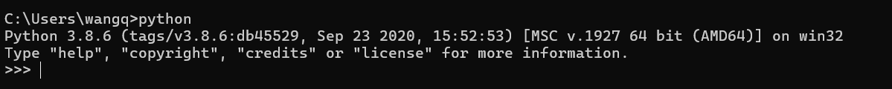
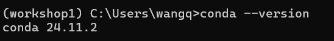
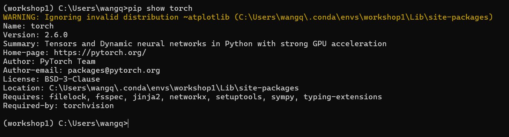
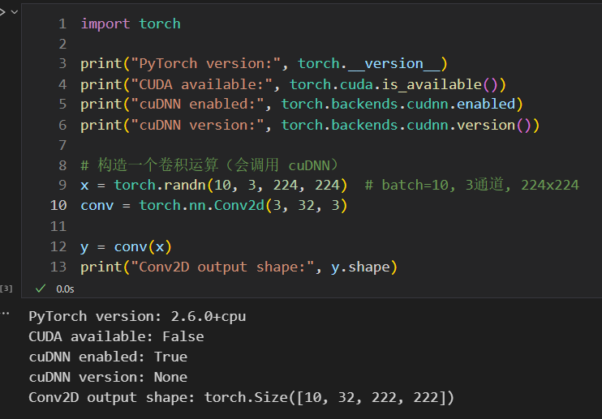
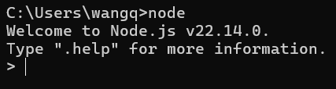
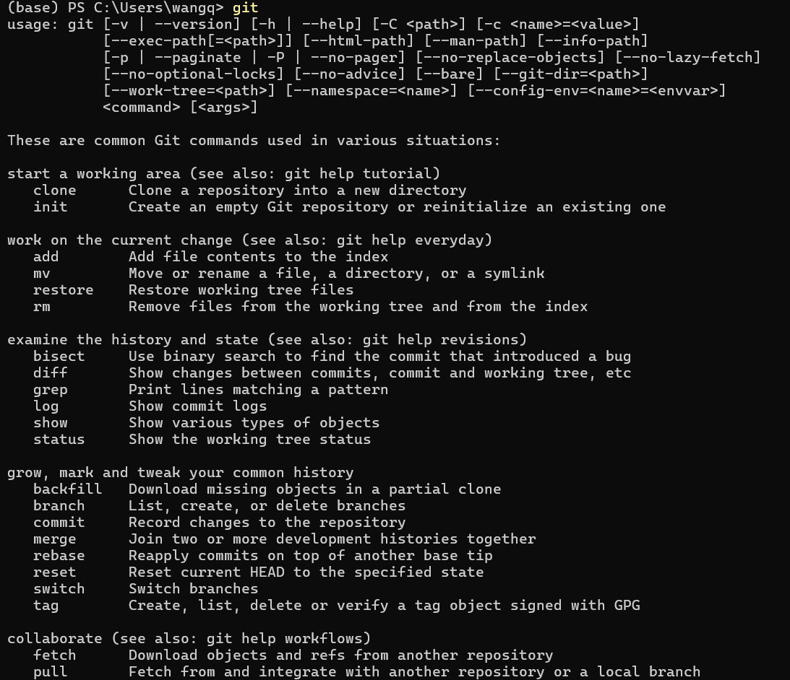

# 第一周：开发环境搭建验证

## 一、环境配置验证

## 1. Python 安装验证
  
*图1：Python 验证*

---

## 2. Anaconda 及 Pytorch 验证
  
*图2：conda 验证*

---

## 3. PyTorch 验证
  
*图3：Pytorch 验证截图*
  
*图3：torch 运行截图*
## 没有独立显卡啊啊啊

---

## 4. nodejs 验证
  
*图4：nodejs 验证截图*

---

## 5. git 验证
  
*图4：git 验证截图*

---

## 二、自问自答

## 1. 没有独立显卡，能正常开发TonyPi Pro机器人吗？

可以正常开发。机器人实际运行靠自身板载芯片，不用电脑显卡；电脑上用PyTorch写代码、调逻辑，CPU完全够用，只是跑模型慢一点，不影响开发流程。

## 2. 装Anaconda到底有啥用？

主要用来管软件依赖，避免冲突。开发机器人要装很多工具，它们对Python版本要求可能不一样，Anaconda能建个专属环境把这些工具管好；后续把代码传到机器人上时，还能快速导出依赖清单，少出问题。不是绝对“非得用”，但用了能省很多麻烦。

## 3. git是干嘛的？

git是管代码版本的工具。改代码时能记录每次修改，改崩了能恢复；还能把电脑上的代码传到机器人上，和同学合作也方便同步。开发机器人是逐步改代码的，用git能避免代码丢了或改乱了，很有必要。

## 4. 验证了Node.js，开发机器人会用到它吗？

可能会用到。比如想做个网页控制机器人移动、看摄像头画面，Node.js能搭个简单服务，让网页和机器人连起来；也能做个页面看机器人的电池电量、传感器数据，挺实用的。

## 5. 环境都验证好了，下一步先做什么测试？

先测电脑和机器人能不能通信。用Python装个serial库，通过USB连机器人，发指令让LED灯亮灭，确认通信正常；再用PyTorch读张图片做简单处理，验证PyTorch能用。这两步做好，后续控电机、读传感器就有基础了。
> （注：文档部分内容可能由 AI 生成）